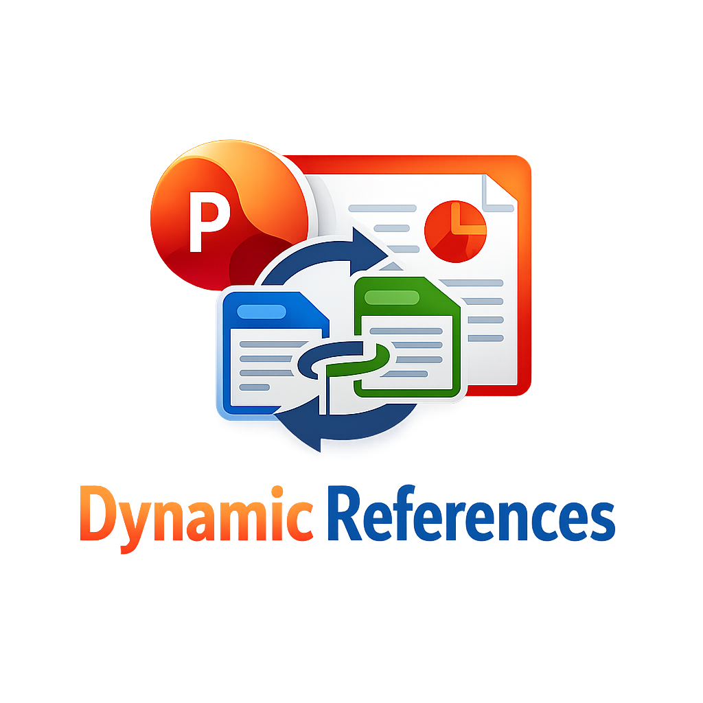

[](https://paypal.me/ThatDudeSebastian?locale.x=de_DE&country.x=DE)
[](https://github.com/AbyssanAnger/PowerPoint-Dynamic-Reference-Manager/issues)

> **Support this project**: If you find this tool helpful, consider [supporting its development](https://paypal.me/ThatDudeSebastian?locale.x=de_DE&country.x=DE). Your feedback is always welcome!

PPDR (PowerPoint Dynamic References) is a PowerPoint add-in that automates
citation management and bibliography generation in presentations. It transforms
citation keys (e.g., `[Smith2020]`) into numbered references such as `[1]` and automatically
generates a formatted bibliography slide from BibTeX files.

The add-in seamlessly integrates with PowerPoint's native interface and supports
standard BibTeX formats exported from popular reference managers like Zotero,
Citavi, and Mendeley. PPDR fills the gap for researchers and academics who need
a simple, reliable way to manage citations in presentations without manual
renumbering or formatting.

---

- [Features](#features)
- [Usage](#usage)
- [Installation](#installation)
- [Building](#building)
- [Known limitations](#known-limitations)
- [Troubleshooting](#troubleshooting)

---

## Features

- **User experience**
  - Fully integrated with PowerPoint: natively implemented in Visual Basic
    for Applications (VBA).
  - Adds a new tab in PowerPoint's ribbon toolbar: managing citations is a
    one-click task.
  - Works with standard BibTeX files exported from Zotero, Citavi, Mendeley,
    and other reference managers.
  - Automatically detects and numbers citations in spatial order (top-left to
    bottom-right).
- **Capabilities**
  - Supports citation keys with alphanumeric characters and special characters.
  - Detects citations within grouped shapes and nested elements.
  - Automatically generates a formatted bibliography slide with all cited
    references.
  - Handles missing BibTeX fields gracefully by omitting them rather than
    showing placeholders.
  - Supports URL and Note fields from BibTeX entries.
  - Maintains citation consistency across the entire presentation.
  - Allows resetting citation history to start fresh numbering.
- **Format support**
  - Works with `.bib` files in standard BibTeX format.
  - Supports common BibTeX entry types: `@article`, `@book`, `@inproceedings`,
    `@misc`, and more.
  - Preserves original slide formatting while updating citations.

## Usage

1. **Load your BibTeX file**: Click `Create Bibliography` in the PPDR ribbon tab
   and select your `.bib` file (e.g., exported from Zotero or Citavi).

2. **Insert citations**: Add citation keys in your slides using the format
   `[Key]`, where `Key` matches the citation key in your BibTeX file:

   ```
   "According to [Smith2020], machine learning is..."
   ```

3. **Update citations**: Click `Update Citations` to:
   - Replace all citation keys with numbered references: `[1]`, `[2]`, etc.
   - Generate a bibliography slide at the end of your presentation.
   - Ensure identical sources receive the same number.

**Example transformation:**

**Before:**

```
Slide 1: "Machine Learning [Smith2020] is important"
Slide 2: "Other studies [Jones2021] and [Smith2020] show..."
```

**After:**

```
Slide 1: "Machine Learning [1] is important"
Slide 2: "Other studies [2] and [1] show..."

Bibliography Slide:
[1] Smith, J. et al. (2020). Machine Learning Fundamentals. IEEE Transactions on Neural Networks.
[2] Jones, A. & Brown, B. (2021). Advanced AI Techniques in Modern Computing. Nature Machine Intelligence.
```

**Additional features:**

- **Reset Citations**: Clear citation history to restart numbering from `[1]`.
- **About & Support**: View version information and access donation link.

[Detailed usage instructions](docs/usage-guide.md) are also available.

_Notice_: The add-in processes all text shapes in your presentation, including
those within groups. Ensure your citation keys are correctly formatted to avoid
detection issues.

**Warning**: Running the add-in will modify your presentation. While PowerPoint's
undo feature (Ctrl+Z) can revert changes, it is strongly advised to work on a
copy of your original presentation to avoid accidentally overwriting it.

---

## Installation

1. Download the latest [PPDR add-in file](Add-In/Dynamic_References.ppam)
   and save it to a location of your choice.

2. Copy the file to PowerPoint's add-ins folder:

   - **Windows**: `%APPDATA%\Microsoft\AddIns\`
   - **MacOS**: `~/Library/Group Containers/UBF8T346G9.Office/`

3. Start PowerPoint.

4. Add the downloaded `Dynamic_References.ppam` as a PowerPoint add-in:

   - **For PowerPoint on Windows**:

     1. Click the _File_ tab, then _Options_.
     2. In the _Options_ dialog box, click _Add-Ins_.
     3. In the _Manage_ list at the bottom, click _PowerPoint Add-ins_, then _Go_.
     4. In the _Add-Ins_ dialog box, click _Add New_.
     5. Browse for `Dynamic_References.ppam` and click _OK_.
     6. If a security notice appears, click _Enable Macros_.

   - **For PowerPoint on MacOS**:
     1. Open the _Tools_ menu on the top bar and select _PowerPoint Add-ins_.
     2. Click _+_ and select `Dynamic_References.ppam`.

---

## Building

PPDR is implemented as a VBA macro inside PowerPoint. The source code is tracked in separate files in the `src/` folder for version control.

**For developers:** Detailed instructions on how to build and package the `.ppam` add-in file can be found in [src/BUILD_ADDIN.md](src/BUILD_ADDIN.md).

**Quick overview:**

- Import VBA modules from `src/` into PowerPoint
- Use Office RibbonX Editor to inject the custom ribbon UI
- Save as PowerPoint Add-In (`.ppam`)

---

## Known limitations

- **BibTeX parsing**: The add-in uses a simple regex-based parser for BibTeX
  files. Complex or malformed BibTeX entries may not be parsed correctly.
- **Citation format**: Only the `[Key]` format is supported by default. To use
  alternative formats (e.g., `(Key)`), you must modify the regex pattern in the
  source code.
- **Bibliography formatting**: The bibliography uses a fixed format. Custom
  citation styles (APA, MLA, Chicago, etc.) are not currently supported.
- **Performance**: Processing presentations with hundreds of slides or thousands
  of text shapes may take several seconds.
- **Grouped shapes**: While the add-in detects citations within grouped shapes,
  deeply nested groups (3+ levels) may cause performance issues.
- **Special characters**: Citation keys with special characters (e.g., `@`, `#`,
  `$`) are supported, but keys with brackets or parentheses may cause parsing
  issues.
- **Undo limitations**: While PowerPoint's undo feature can revert changes, the
  undo stack may be cleared after processing large presentations.
- **Cross-platform compatibility**: The add-in is primarily tested on Windows.
  MacOS compatibility is expected but not extensively tested.

---

## References

- [Project home page](https://github.com/AbyssanAnger/PowerPoint-Dynamic-Reference-Manager)
- [BibTeX format specification](http://www.bibtex.org/Format/)

# Troubleshooting

_The add-in does not appear in the PowerPoint ribbon._

Ensure the add-in is properly loaded:

1. Go to `File` → `Options` → `Add-Ins`.
2. Check if `Dynamic_References` appears in the list.
3. If not, follow the [manual installation](#manual-installation) steps.

---

_Citations are not being detected._

Ensure your citation keys:

- Are enclosed in square brackets: `[Key]`.
- Match the keys in your BibTeX file exactly (case-sensitive).
- Do not contain unsupported special characters like `[`, `]`, `(`, `)`.

---

_The bibliography slide is empty._

This may occur if:

- No BibTeX file was loaded (click "Create Bibliography" to load one).
- No citations were found in the presentation.
- The BibTeX file is malformed or empty.

---

_Macro security warning appears._

PowerPoint's macro security settings may block the add-in:

1. Go to `File` → `Options` → `Trust Center` → `Trust Center Settings`.
2. Click `Macro Settings`.
3. Select "Enable all macros" or "Disable all macros with notification".
4. Restart PowerPoint and enable the add-in when prompted.

---

_The add-in is slow on large presentations._

Processing time increases with the number of slides and text shapes:

- Consider splitting large presentations into smaller sections.
- Ensure no unnecessary grouped shapes or hidden elements exist.
- Close other applications to free up system resources.

---

_Changes are not being applied._

Ensure:

- Macros are enabled (see macro security warning above).
- You clicked "Update Citations" after loading the BibTeX file.
- The presentation is not in read-only mode.

---

**Still having issues?** Please [open an issue](https://github.com/AbyssanAnger/PowerPoint-Dynamic-Reference-Manager/issues) on GitHub with:

- Your PowerPoint version (e.g., PowerPoint 2019, Microsoft 365).
- Operating system (Windows/MacOS).
- A description of the problem and steps to reproduce it.
